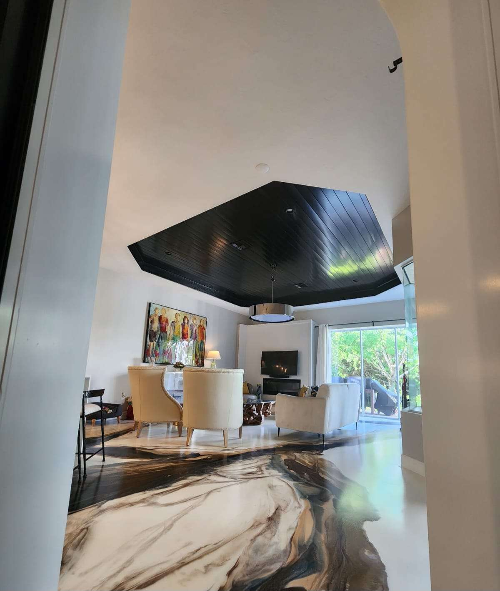
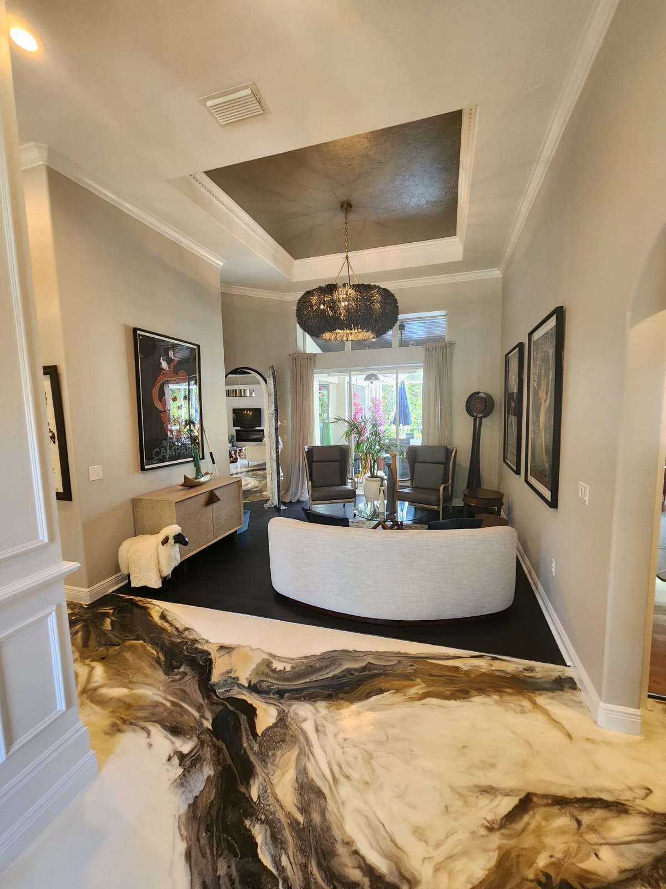
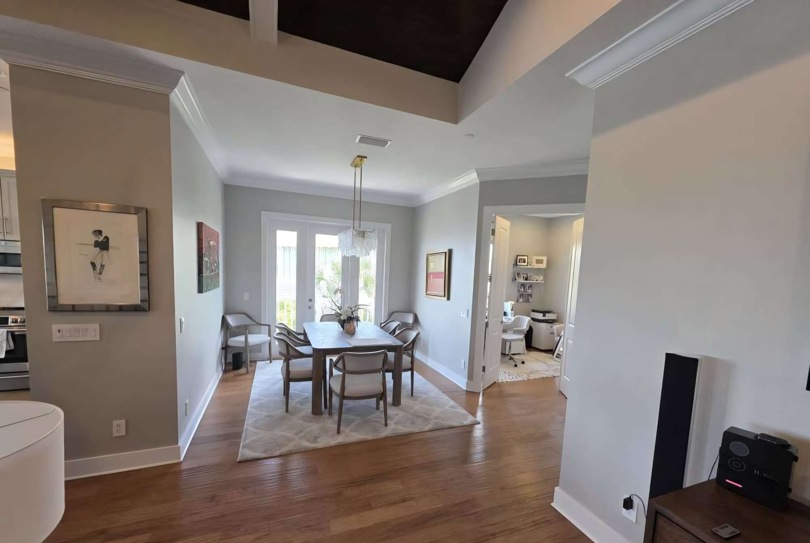
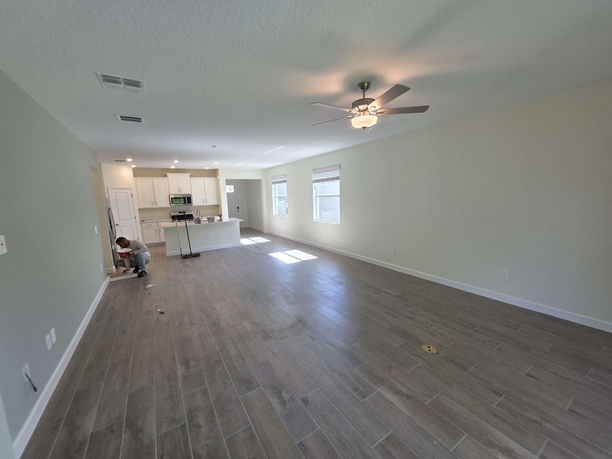
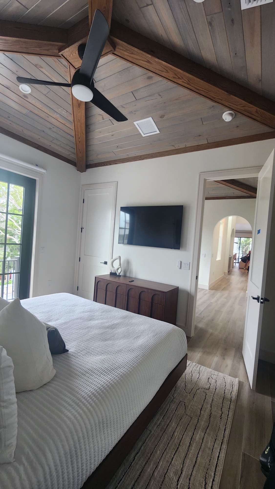
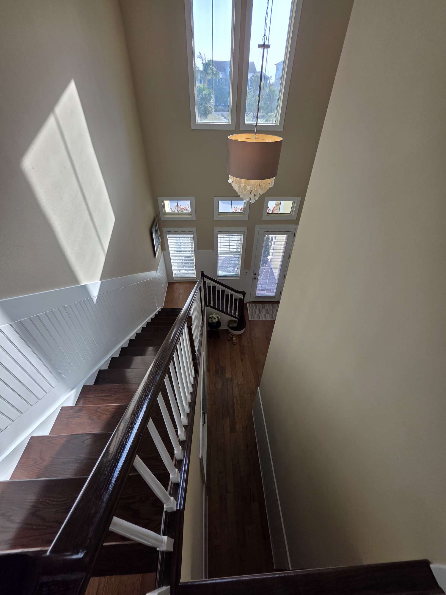

Meta Title

Interior Painting Manatee County | Interior House Painters | Gold Lion Painting Inc

Meta Description

Professional interior painting services in Manatee County by Gold Lion Painting Inc. Interior house painters for walls, ceilings, trim, drywall repair, and full home repainting. Fully insured. 10+ years of experience. Sherwin-Williams paint systems.

Interior Painting Services in Manatee County
Professional Interior House Painters for Clean, Durable, High-End Results

Gold Lion Painting Inc provides professional interior painting services in Manatee County for homeowners who want cleaner finishes, sharper lines, better durability, and a more updated interior without major remodeling. If your walls, ceilings, trim, doors, or living spaces look faded, worn, scuffed, outdated, or uneven, a properly planned repaint can completely change the home.

Our company focuses on residential interior painting, with structured preparation, controlled application, and long-term performance in mind. We do not treat interior painting like a quick color change. We treat it as a finish system that affects appearance, cleanliness, durability, and the overall quality people feel when they walk through the property.

We are fully insured, our painters bring 10+ years of experience, and qualifying projects include a 5-year workmanship warranty.

Call Gold Lion Painting Inc: 941-462-5894

Featured Interior Project Gallery

A curated selection of interior transformations that highlight smooth wall finishes, clean trim lines, and high-end residential presentation.

| Open-Concept Living Space | Modern Interior Contrast | Primary Bedroom Finish |
| --- | --- | --- |
|  |  |  |

| Coastal Blue Interior Palette | High-End Modern Interior | Luxury Interior Finish |
| --- | --- | --- |
|  |  |  |

These photos represent the finish quality and detail standards our interior painting team delivers across Manatee County homes.

Residential Interior Painting That Improves the Entire Home

A professional interior repaint does more than refresh wall color. It can improve brightness, visual consistency, perceived cleanliness, architectural definition, and overall property presentation. For many homeowners, interior house painting is one of the highest-impact upgrades available without entering the cost and disruption of major renovation.

Our interior painters in Manatee County work on homes where:

wall color feels outdated

ceilings show age or discoloration

trim looks worn or yellowed

previous paint work has visible flaws

drywall repairs are needed before repainting

homeowners want a cleaner, more modern interior

Whether the goal is a full interior repaint or selected room updates, the work must be organized correctly from the start.

Interior Painters in Manatee County for Walls, Ceilings, Trim, and Doors

We provide interior painting services for the most visible painted surfaces inside the home, including:

walls

ceilings

baseboards

crown molding

window trim

door casings

interior doors

painted millwork

hallways

bedrooms

living rooms

dining rooms

kitchens

bathrooms

laundry rooms

entry areas

A complete interior painting project often involves much more than rolling paint on walls. Durable and attractive results depend on how each surface is prepared, repaired, primed, and finished.

Our Interior Painting Process

Our process is built to deliver cleaner finishes, stronger adhesion, and a more professional final result in occupied residential homes.

1. Surface Evaluation

Before work begins, we inspect wall condition, ceiling condition, prior paint failure, patch areas, stress cracks, nail pops, drywall imperfections, and transitions between different surfaces. This helps define the correct scope and prevents avoidable finish issues later.

2. Protection of Floors, Furniture, and Adjacent Surfaces

A professional interior house painter must protect the home before applying coatings. Floors, furniture, fixtures, counters, and nearby surfaces are covered and protected to keep the project clean and controlled.

3. Drywall Repair and Surface Correction

Minor drywall damage, failed patchwork, dents, cracks, and surface irregularities can be corrected before painting. This step is essential because interior lighting exposes imperfections very easily, especially on smooth walls and large open areas.

4. Sanding, Caulking, and Adhesion Preparation

Glossy surfaces, rough transitions, patch zones, trim edges, and previously painted areas may need conditioning before finish coats are applied. Adhesion and finish quality improve when surfaces are prepared correctly.

5. Primer Application When Needed

Primer helps stabilize repaired areas, improve coverage, support adhesion, and create a better foundation for the final finish system. The right primer strategy matters in repaint projects with repairs, color changes, stains, or inconsistent existing coatings.

6. Finish Coat Application

Finish coats are applied with attention to consistency, line clarity, coverage, sheen control, and long-term durability. The goal is a cleaner and more uniform look throughout the painted area.

7. Final Review and Touch-Ups

After the main painting is complete, we review details, coverage, transitions, and touch-up areas so the final presentation feels finished, polished, and professional.

Why Surface Preparation Matters in Interior Painting

Preparation determines whether a paint job looks sharp for the long term or starts losing quality early. Even premium products cannot compensate for poor prep. A room can receive new paint and still look weak if the underlying surfaces were not corrected properly.

Proper prep improves:

adhesion

durability

finish smoothness

cleaner cut lines

better color uniformity

improved sheen consistency

fewer visible defects under light

For homeowners searching for high-quality interior painting in Manatee County, preparation is one of the biggest differences between basic repainting and professional repainting.

Interior House Painting for Occupied Homes

Most repaint projects happen while homeowners are living in the property. That means project organization matters just as much as product selection.

A strong occupied-home painting process includes:

room-by-room sequencing

daily site organization

clean containment practices

protected walk paths

reduced disruption to normal home use

clear communication during each phase

People are not only hiring painters for color. They are hiring for a process that feels reliable, clean, and professionally managed from start to finish.

Wall Painting, Ceiling Painting, and Trim Painting

Different interior surfaces require different expectations and finishing logic.

Wall Painting

Walls affect most of the visual field in a home. They influence brightness, mood, cleanliness, and how modern the house feels. Proper wall painting depends on prep quality, color selection, and even finish distribution.

Ceiling Painting

Ceilings often show age through discoloration, stains, patching marks, and uneven texture. Fresh ceiling paint can make a room feel brighter, cleaner, and more finished.

Trim Painting

Baseboards, casings, doors, and crown molding give the room structure. When trim is worn, chipped, yellowed, or poorly painted, the whole home feels older. Proper trim painting improves edge definition and gives interior spaces a more refined appearance.

Sheen Selection, Lighting, and Color Flow

Paint color does not exist in isolation. Natural light, artificial lighting, open floor plans, adjacent rooms, ceiling height, and reflectivity all affect how interior paint looks after completion.

Choosing the right sheen is also important:

flatter finishes can soften minor wall imperfections

eggshell and satin can improve cleanability in active living areas

trim and doors often require a stronger finish for durability and visual contrast

In connected spaces, color flow matters. Hallways, kitchens, living rooms, dining rooms, and entry areas should feel visually coordinated rather than disconnected.

Sherwin-Williams Interior Paint Systems

Gold Lion Painting Inc uses Sherwin-Williams paint systems, including Duration and Emerald, when those products are the right match for the project. Product choice depends on surface condition, desired sheen, room use, durability expectations, and the type of finish homeowners want.

A professional interior painting company should not treat every room the same. Kitchens, hallways, bedrooms, bathrooms, ceilings, trim, and high-contact surfaces all place different demands on the coating system.

Drywall Repair and Interior Repainting

Many homeowners searching for interior painting services also need minor wall repair before painting begins. Repainting over dents, hairline cracks, nail pops, rough patches, and failed repairs usually leads to a weaker final result.

For that reason, drywall correction is often part of a professional repaint strategy. When walls are repaired correctly before painting, the finished space looks cleaner, straighter, and more intentional.

Why Homeowners Choose Interior Repainting Instead of Renovation

A full renovation can be expensive, disruptive, and time-consuming. In many homes, interior repainting provides a major visual improvement without the budget and disruption associated with larger remodeling work.

Interior repainting can help:

modernize outdated rooms

improve resale presentation

refresh worn living areas

update color schemes

improve how clean the house feels

create a more cohesive interior design

extend the visual life of walls, ceilings, and trim

For homeowners who want a meaningful upgrade without major demolition, painting is often the most efficient path.

Interior Painting Services for Different Types of Homes

Not every house has the same goals. Some homeowners want a simple and clean refresh before moving in or selling. Others want a more design-driven repaint with stronger finish expectations and complete trim updates.

Our interior painting company in Manatee County can adapt the scope based on:

home size

room count

existing condition

finish level

durability expectations

timeline needs

whether the property is occupied or vacant

The process stays disciplined, but the level of detail can be tailored to the home and the homeowner’s priorities.

Professional Interior Painters Focused on Clean Execution

Homeowners often search for:

best interior painters near me

interior house painters in Manatee County

residential painters in Bradenton

Lakewood Ranch interior painters

wall and ceiling painters

trim painting services

house repainting contractors

Those searches all point to the same core need: people want painters who show up professionally, prepare correctly, protect the home, communicate clearly, and deliver durable results.

That is exactly where our service is focused.

Related Home Painting Services

Many interior repaint projects are part of a broader home improvement plan. To create a more complete transformation, homeowners often combine interior painting with:

Cabinet Painting Services

Exterior Painting Services

Related service pages also help strengthen internal linking and overall site relevance for residential painting searches.

Frequently Asked Questions About Interior Painting
How long does interior painting take?

Interior painting timelines depend on square footage, number of rooms, surface condition, repair needs, trim scope, and whether the home is occupied during the project.

Do you do drywall repair before painting?

Yes. Minor drywall repairs, patching corrections, crack repair, and surface improvement can be included as part of project preparation.

Do you paint ceilings, trim, and doors?

Yes. Interior painting projects can include walls, ceilings, baseboards, casings, crown molding, interior doors, and other painted millwork.

What paint do you use for interior painting?

We commonly use Sherwin-Williams interior systems, including Duration and Emerald, when those are the right fit for the surface and project goals.

Are you insured?

Yes. Gold Lion Painting Inc is fully insured.

Do you offer residential interior painting in Manatee County?

Yes. We provide residential interior painting services throughout Manatee County.

How do I get an estimate for interior painting?

Visit /contact/ or call 941-462-5894 to request an estimate.

Service Areas for Interior Painting in Manatee County

We proudly provide interior painting services in Manatee County, including:

Lakewood Ranch

Bradenton

Parrish

Palmetto

Ellenton

Anna Maria Island

Holmes Beach

If you are looking for interior painters near Bradenton, house painters in Lakewood Ranch, or residential painters in Manatee County, Gold Lion Painting Inc can help.

Request an Interior Painting Estimate

A professional interior repaint can make a home feel brighter, cleaner, more current, and better maintained without the disruption of full renovation. With the right preparation, drywall correction, product selection, and finish control, interior painting becomes more than a cosmetic change. It becomes a practical upgrade in how the property looks, feels, and performs.

If your walls, ceilings, trim, or living spaces need a cleaner and more durable finish, Gold Lion Painting Inc provides professional interior painting services in Manatee County with structured execution and residential-focused care.
Get a Free Estimate